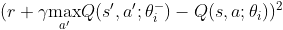
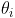
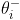
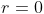
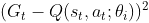
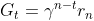
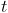
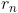

# Reinforcement Learning Repo
This is a repo where I test reinforcement learning algorithms on board games. Details on how the board games and algorithms are implemented can be found below.

## Games
* [Tic Tac Toe](#tic-tac-toe)
* [Connect Four](#connect-four)
* [Incan Gold](#incan-gold)

## Algorithms
* [Deep Q-Network (DQN)](#deep-q-network-dqn)
* [Muzero](#muzero)

## Commentary
* [Results](#results)
* [My Journey](#my-journey)

### Tic Tac Toe
* A 2 player perfect information game
* Observations of the game state were represented using two 3 x 3 binary matrices (one for each player)
    * the binary matrices contain a value of 1 if a piece corresponding to that player is occupying that corresponding space on the 3 x 3 grid, 0 otherwise
* The binary matrices are combined together to make a 2 x 3 x 3 binary matrix feature representation of the game state
    * The first slice always contains the current active player's pieces
    * The second slice always contains the opponent's pieces (in the perspective of the current active player)
* The action space is of size 9, which corresponds to the number of spaces in the tic tac toe grid

### Connect Four
* A 2 player perfect information game
* Similar to tic tac toe, observations of the game state were represented by using two 6 x 7 binary matrices (one for each player)
    * the binary matrices contain a value of 1 if a piece corresponding to that player is occupying that corresponding space on the 6 x 7 grid, 0 otherwise
* The binary matrices are combined together to make a 2 x 6 x 7 binary matrix feature representation of the game state
    * The first slice always contains the current active player's pieces
    * The second slice always contains the opponent's pieces (in the perspective of the current active player)
* The action space is of size 7, which corresponds to placing your piece on one of the 7 columns of the Connect Four grid

### Incan Gold
* A 3+ player imperfect information game
* Rules summary (full rules can be found [here](https://en.doc.boardgamearena.com/Gamehelpincangold), based on the version from Board Game Arena):
    * the goal is to collect as many points as possible
    * game is divided into 5 identical rounds
    * each round all players enter the temple and each turn, they can choose to stay or leave
    * staying lets them collect more points from treasure found in the temple, but puts them at greater risk
    * there are hazards in the temple and if two identical hazard cards are drawn from the deck, then the players still in the temple lose all the points they've collected during this round
    * choosing to leave the temple will allow the players to add the points they collected this round to their overall point total (which is carried throughout all 5 rounds), but they cannot participate for the rest of the round
* Observations of the game state are represented by the number of points each player has, which opponents are still active in the current round, what cards are present in the temple, and what's left in the deck
    * Players have 2 features: the number of points they collected this round from the temple so far and their overall point total
        * The version I implemented is a 3-player game, so with 3 players of 2 features each, that's 6 features in total
        * The first 2 features are always the current active player's features, followed by the features of the opponent with the highest point total of the two opponents, followed by the features of the last opponent
    * A binary value is used to indicate whether the opponent with the higher point total is still active this round, and another binary value is used to indicate whether the other opponent is still active this round
    * The board has 9 features: the number of points on the board, the number of 5-point artifacts on the board, the numer of 10-point artifacts on the board, the number of fire cards on the board, the number of mummy cards on the board, the number of rock cards on the board, the number of snake cards on the board, the number of spider cards on the board, and the number of active players in this round
    * The deck has 17 one-hot encoded features: each feature is a value representing how many of a particular card is present in the deck currently
    * These features are concatenated together to give an overall: 2 x 3 + 2 + 9 + 17 = 34 features to represent the Incan Gold game state
    * Note: some of these features are normalized
* The action space is of size 2, which corresponds to leaving and staying

### Deep Q-Network (DQN)
* [link to paper](https://www.nature.com/articles/nature14236)
* DQN is an algorithm that uses the concept of Q-learning, with the use of neural networks as the action-value function
* It was used by DeepMind to create reinforcement learning agents that could perform at professional human levels on Atari games
* Some important features of DQN:
    * The TD-error for the DQN is:  , where  is the action value function (represented by a neural network),  are the network's parameters at iteration , and  are the target network's parameters at iteration 
    * The implementation of an experience replay buffer that is sampled from during training
* Originally I implemented the algorithm denoted in the paper (with a target network and replay buffer), but later altered it for simplification:
    * Since I was solely working on 2+ player board games, the environments are such that the episodes will always terminate and will always have a winner/loser and/or players that tie
    * Thus I formulated the terminal rewards to be +1 for winning, 0 for tieing, and -1 for losing or doing illegal moves, with no transition rewards ()
    * I also removed the target network as I reasoned that taking the discounted terminal reward as the expected return was good enough for environments where the only reward given is at the end of the episode, and that there was no need for a neural network estimate of the expected return when I can use, essentially, a sample of the actual return instead (similar to Monte Carlo methods)
        * removing the target network also saves some computation time as computing a neural network inference is longer than just calculating discounted reward values
    * Thus the error that my implementation of the neural network optimizes for is: , where  is the expected return at time  for a particular sample trajectory,  is the number of time steps in this trajectory, and therefore  is the terminal reward

### MuZero
* [link to paper](https://arxiv.org/abs/1911.08265)

### Results
I was surprised to see an interesting strategy my Tic Tac Toe agent employed, where it would start with a play on the top right corner. Naturally I'd take the center on my turn, as that's the common wisdom of this game. It then proceeded to play on the center bottom square, which I found very unusual. I ended up falling for a double trap, which really caught me off guard considering how simple Tic Tac Toe is. The agent used a form of double trap that I've never seen before, as I'm used to other patterns that humans usually play.

For Connect Four, the agent has managed to beat me every time. Doing some research, I know that Connect Four is solved, and that the first player can be guaranteed to win through optimal play, and by placing his first piece in the middle column. The agent I played against did just that (although I'm not sure if it really is optimal, but it manages to beat me everytime it starts first, and always places its first piece in the center column)

### My Journey
I got interested in reinforcement learning after watching the livestream of DeepMind's AlphaGo defeating Lee Se-dol. I read Sutton and Barto's [Reinforcement Learning: An Introduction, 2nd ed.](http://incompleteideas.net/book/the-book.html) and wanted to see if I could apply reinforcement learning to board games. I started off with the small Tic Tac Toe game, and decided to use a DQN, as I wanted practice using neural networks in reinforcement learning algorithms. I then tried applying DQN to Connect Four, as it is quite similar to Tic Tac Toe, albeit the observation and action space is bigger. 

After Connect Four, I wanted to try expanding the algorithm on games with more than 2 players and also games that didn't have perfect information, and so I chose Incan Gold. To my surprise, the overall observation and action space is smaller than Connect Four!
