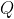
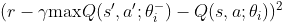
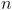

# Reinforcement Learning Repo
This is a repo where I test reinforcement learning algorithms on board games. Details on how the board games and algorithms are implemented can be found below.

## Requirements
* Python 3.7.7
* Numpy 1.18.5
* Tensorflow 2.2.0

## Games
* [Tic Tac Toe](#tic-tac-toe)
* [Connect Four](#connect-four)
* [Incan Gold](#incan-gold)
* [Gwent Lite](#gwent-lite)

## Algorithms
* [Deep Q-Network (DQN)](#deep-q-network-dqn)
* [Muzero](#muzero)
* [Genetic Algorithm](#genetic-algorithm)

## Commentary
* [Results](#results)
* [My Journey](#my-journey)

### Tic Tac Toe
* A 2 player perfect information game
* Observations of the game state were represented using two 3 x 3 binary matrices (one for each player)
    * The binary matrices contain a value of 1 if a piece corresponding to that player is occupying that corresponding space on the 3 x 3 grid, 0 otherwise
* The binary matrices are combined together to make a 2 x 3 x 3 binary matrix feature representation of the game state
    * The first slice always contains the current active player's pieces
    * The second slice always contains the opponent's pieces (in the perspective of the current active player)
* The action space is of size 9, which corresponds to the number of spaces in the tic tac toe grid

### Connect Four
* A 2 player perfect information game
* Similar to tic tac toe, observations of the game state were represented by using two 6 x 7 binary matrices (one for each player)
    * The binary matrices contain a value of 1 if a piece corresponding to that player is occupying that corresponding space on the 6 x 7 grid, 0 otherwise
* The binary matrices are combined together to make a 2 x 6 x 7 binary matrix feature representation of the game state
    * The first slice always contains the current active player's pieces
    * The second slice always contains the opponent's pieces (in the perspective of the current active player)
* The action space is of size 7, which corresponds to placing your piece on one of the 7 columns of the Connect Four grid

### Incan Gold
* A 3+ player imperfect information game
* Rules summary (full rules can be found [here](https://en.doc.boardgamearena.com/Gamehelpincangold), based on the version from Board Game Arena):
    * The goal is to collect as many points as possible
    * Game is divided into 5 identical rounds
    * Each round all players enter the temple and each turn, they can choose to stay or leave
    * Staying lets them collect more points from treasure found in the temple, but puts them at greater risk
    * There are hazards in the temple and if two identical hazard cards are drawn from the deck, then the players still in the temple lose all the points they've collected during this round
    * Choosing to leave the temple will allow the players to add the points they collected this round to their overall point total (which is carried throughout all 5 rounds), but they cannot participate for the rest of the round
* Observations of the game state are represented by the number of points each player has, which opponents are still active in the current round, what cards are present in the temple, and what's left in the deck
    * Players have 2 features: the number of points they collected this round from the temple so far and their overall point total
        * The version I implemented is a 3-player game, so with 3 players of 2 features each, that's 6 features in total
        * The first 2 features are always the current active player's features, followed by the features of the opponent with the highest point total of the two opponents, followed by the features of the last opponent
    * A binary value is used to indicate whether the opponent with the higher point total is still active this round, and another binary value is used to indicate whether the other opponent is still active this round
    * A scalar value to indicate which round out of 5 the game is currently on
    * The board has 9 features: the number of points on the board, the number of 5-point artifacts on the board, the numer of 10-point artifacts on the board, the number of fire cards on the board, the number of mummy cards on the board, the number of rock cards on the board, the number of snake cards on the board, the number of spider cards on the board, and the number of active players in this round
    * The deck has 17 one-hot encoded features: each feature is a value representing how many of a particular card is present in the deck currently
    * These features are concatenated together to give an overall: 2 x 3 + 2 + 1 + 9 + 17 = 35 features to represent the Incan Gold game state
    * Note: some of these features are normalized
* The action space is of size 2, which corresponds to leaving and staying

### Gwent Lite
* A 2 player imperfect information game
* This game is inspired by Gwent, a digital collectible card game which is based on the Witcher series, developed by CD Projekt Red (although Gwent Lite is a much more simplified implementation with loosely similar game rules)
* Rules summary:
    * Each player starts the game with a deck, where each card represents a number that's at least 1
    * Decks have two constraints: it must have a minimum card count, and the total sum of the card values in the deck cannot exceed a certain number
        * I arbitrarily picked a minimum card count of 25 and a max total sum of 100 for the deck constraints
    * The game is played in rounds, where the goal is to win 2 rounds (essentially a best out of 3)
    * Players start the game (in round 1) drawing 10 cards from their deck, and take turns either playing a card from their hand or passing
    * Placing a card adds to your current round total equal to that card's value, while passing means that you will no longer play anymore cards this round
    * Once both players have passed, the player with the highest round total wins that round, and the game proceeds to the next round 
    * Every new round, each player draws 3 new cards from their deck or until their hand is full (maximum 10 cards), whichever comes first
    * In the case of ties, both players earn a round win for that round (this ensures that the game never exceeds 3 rounds)
* Observations of the game state are represented by the current player's features, the opponent's features and the game features:
    * Current player features:
        * A one hot representation of their deck (76 features with the deck constraints I used)
        * A value representation of their hand, where the value is equal to the card power, 0 for "blank slots" in hand if the hand isn't full (10 features)
        * Number of unplayed cards, which is equivalent to summing the number of cards in the deck and hand (1 feature)
        * Number of points the player has in the current round (1 feature)
        * Number of round wins the player has (1 feature)
        * Total remaining card value, which is equivalent to summing the card values in the player's deck and hand (1 feature)
        * Average remaining card value, which is equivalent to dividing the total remaining card value by the number of unplayed cards (1 feature)
    * Opponent features:
        * Number of cards remaining in the opponent's deck (1 feature)
        * Number of cards in the opponent's hand (1 feature)
        * Number of unplayed cards, which is equivalent to summing the number of cards in the deck and hand (1 feature)
        * Number of points the opponent has in the current round (1 feature)
        * Number of round wins the opponent has (1 feature)
        * Total remaining card value, which is equivalent to summing the card values in the opponent's deck and hand (1 feature)
        * Average remaining card value, which is equivalent to dividing the total remaining card value by the number of unplayed cards (1 feature)
    * Game features:
        * Current round number (1 feature)
        * Number of active players in this round (1 feature)
    * These features are concatenated together to give an overall total of 100 features to represent the Gwent Lite game state
    * Note: some of these features are normalized
* The action space is of size 11, which corresponds to playing one of the 10 cards in your hand or passing

### Deep Q-Network (DQN)
* [link to paper](https://www.nature.com/articles/nature14236)
* DQN is an algorithm that uses the concept of Q-learning, with the use of neural networks as the action-value function
* It was used by DeepMind to create reinforcement learning agents that could perform at professional human levels on Atari games
* Some important features of DQN:
    * The TD-error for the DQN is:  , where  is the action value function (represented by a neural network),  are the network's parameters at iteration , and  are the target network's parameters at iteration 
    * An experience replay buffer is implemented, which is sampled from during training
* Originally I implemented the algorithm denoted in the paper (with a target network and replay buffer), but later altered it for simplification:
    * Since I was solely working on 2+ player board games, the environments are such that the episodes will always terminate and will always have either a winner/loser and/or players that tie, or a player that made an illegal move that caused the episode to terminate prematurely
    * Thus I formulated the terminal rewards to be +1 for winning, 0 for tieing, and -1 for losing or making illegal moves, with no transition rewards ()
    * Since the original DQN algorithm was run on single player Atari games, I had to change the TD-error to account for 2-player zero-sum games
        * In 2-player zero-sum games, the opponent's chance of losing is directly equivalent to your chance of winning, and vice versa
        * In the 2-player games I implemented, players alternate taking actions (i.e. a player never takes more than 1 action in a row), therefore in the original TD-error :
            *  is the state at the start of the current player's turn and  is the action that player took
            *  is the resulting state, which is the state at the start of the next player's turn and  is the action that the next player would take if that player wants to maximize their action-value, according to the target network's parameters 
            * However since these 2-player games are zero-sum, one player's action-value estimate is the negative equivalent in the perspective of the other player, thereby making the TD-error: 
    * Training with this updated TD-error worked for 2-player zero-sum games, but wouldn't work for 3 player games like Incan Gold as the game is not zero-sum; i.e. one opponent's chance of losing is not directly equivalent to your chance of winning, as there's another opponent in the game (who may also benefit from that opponent having a lower chance of winning), and vice versa
    * Therefore the target network estimate of the expected return, , won't work for 3+ player games
    * Rather than using the target network estimate as the expected return, I reasoned that taking the discounted terminal reward as the expected return was good enough for environments where the only reward given is at the end of the episode, and that there was no need for a neural network estimate of the expected return when I can use, essentially, a sample of the actual return instead (similar to Monte Carlo methods), thereby removing the need of the target network
        * Removing the target network also saves some computation time as computing a neural network inference is longer than just calculating discounted reward values
    * Thus the error that my implementation of the neural network optimizes for is: , where  is the expected return at time  for a particular sample trajectory,  is the number of time steps in this trajectory, and therefore  is the terminal reward
        * Each episode of self-play is split into a number of separate trajectories equal to the number of players in the game, and each trajectory is assigned its corresponding terminal reward and associating discounted rewards based on the result of the game (e.g. in a 3 player game of Incan Gold, if there are no ties, one trajectory is given a +1 reward for winning while the other two trajectories are given a -1 reward for losing)
    * I kept the implementation of the experience replay buffer, as I empirically found it to help with convergence
* I also modified how illegal moves are dealt with in the algorithm:
    * Originally once the episode terminates either by the game being over or an illegal move being made, the terminal reward and associating discounted rewards are calculated and assigned to all states encountered and actions taken during the episode
    * However I came to realize that the illegal move being made is not dependent on the previous states and actions that lead to the current state; rather it's just a matter of the neural network parameters outputting an illegal move as the most promising action
    * That is to say, the previous states and actions leading up to the illegal move shouldn't be assigned the discounted illegal move reward (-1), as it could very well be that those actions were good strategy; it just so happens that for the current state, the neural network outputted an illegal move
    * Therefore if an episode terminates due to an illegal move, only the most recent state and action, along with the illegal reward, is added to the replay buffer, since that action is illegal and is directly responsible for terminating the episode prematurely
        * The rest of the previous states and actions are discarded
    * If the episode ends naturally with a game over, then all states encountered and actions taken during the episode, along with the associated discounted rewards, are added to the replay buffer

### MuZero
* [link to paper](https://arxiv.org/abs/1911.08265)

### Genetic Algorithm
* An algorithm to iteratively improve deck compositions in Gwent Lite
* Every iteration, the trained AI uses each deck in the current deck pool and plays a number of games against every other deck in the deck pool
* The decks with the highest winrate are then added to the deck pool for the next iteration, while the rest of the decks are discarded
* "Offspring" decks are then generated from these "winning" decks by copying the deck and then mutating the cards (specifically for every card in the deck, there is a certain percentage that the card will mutate, and the value of that card changes according to a value sampled from a normal distribution)
* These offspring decks are added to the deck pool and the remaining space in the deck pool is filled by randomly generated decks (to add diversity to the deck pool)

### Results
I was surprised to see an interesting strategy my Tic Tac Toe agent employed, where it would start with a play on the top right corner. Naturally I'd take the center on my turn, as that's the common wisdom of this game. It then proceeded to play on the center bottom square, which I found very unusual. I ended up falling for a double trap, which really caught me off guard considering how simple Tic Tac Toe is. The agent used a form of double trap that I've never seen before, as I'm used to other patterns that humans usually play.

For Connect Four, the agent has managed to beat me every time. Doing some research, I know that Connect Four is solved, and that the first player can be guaranteed to win through optimal play, and by placing his first piece in the middle column. The agent I played against did just that (although I'm not sure if it really is optimal, but it manages to beat me everytime it starts first, and always places its first piece in the center column)

### My Journey
I got interested in reinforcement learning after watching the livestream of DeepMind's AlphaGo defeating Lee Se-dol. I read Sutton and Barto's [Reinforcement Learning: An Introduction, 2nd ed.](http://incompleteideas.net/book/the-book.html) and wanted to see if I could apply reinforcement learning to board games. I started off with the small Tic Tac Toe game, and decided to use a DQN, as I wanted practice using neural networks in reinforcement learning algorithms. I then tried applying DQN to Connect Four, as it is quite similar to Tic Tac Toe, albeit the observation and action space is bigger. 

After Connect Four, I wanted to try expanding the algorithm on games with more than 2 players and also games that didn't have perfect information, and so I chose Incan Gold. To my surprise, the overall observation and action space is smaller than Connect Four!

I then wanted to try working on a game that required decisions to be made before the game actually started. In GwentLite, and other similar trading/collectible card games like Gwent, Hearthstone, and Magic: The Gathering, players have to make decisions about what kind of deck they want to build and use before the game starts. This type of pre-game decision making isn't just solely for card games, for example in Pokemon, you would have to make a decision on what kind of Pokemon you want on your team, as well as what abilities, items and stats to have for each Pokemon. The fact that these decisions have to be made based on the game's constraints, whether that's minimum/maximum deck size and limited card copies for card games or certain abilities can only be learned by specific Pokemon, it really interests me to see whether an AI algorithm can be used to determine what is the optimal decision to make when constructing a deck/team prior to the game starting. Particularly in Magic: The Gathering, being a casual player myself, I always wondered given a set pool of cards that all players have access to, is there a way to construct an optimal deck that will have the highest chances of winning?
Since card games are hard quite complex environments to implement, I decided to make a simpler version of the pre-existing collectible card game, Gwent. I decided to use a genetic algorithm to iteratively improve on deck compositions, given the deck constraints, by having an AI play against itself using different randomly-generated decks. There were two options I considered when training an AI: either train with randomized decks to create a general deck-playing Agent, or train with specific decks and create specialized deck-playing Agents for each specific deck. Unfortunately my computer setup doesn't have enough compute power to explore the latter option, so I went with the former method. I used randomized decks and DQN to train the AI Agent and then used a genetic algorithm and the trained AI to iteratively improve the deck pool.